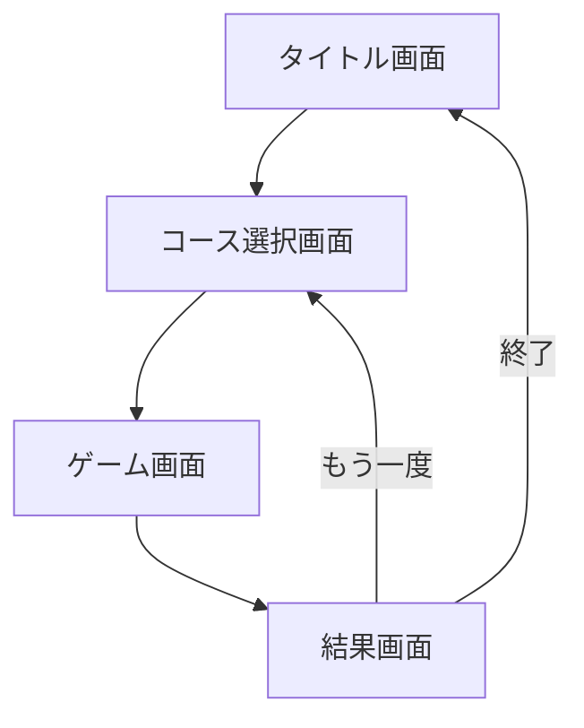

# アプリ画面フロー設計

このプロジェクトでは、以下の4つの主要画面を通じてゲームが進行します。

## 1. タイトル画面 (Title Screen)
- **役割**: アプリの起動画面。
- **配置要素**: 
    - ゲームタイトルロゴ（和風）
    - 「スタート」ボタン
    - 遊び方説明へのリンク
- **遷移**: 「スタート」クリックで **コース選択画面** へ。

## 2. コース選択画面 (Course Select)
- **役割**: 難易度と制限時間の選択。
- **配置要素**: 
    - 3,000円コース（初級：2〜7文字、60秒）
    - 5,000円コース（中級：5〜10文字、90秒）
    - 10,000円コース（上級：9文字以上、120秒）
- **遷移**: コース選択で **ゲーム画面** へ。

## 3. ゲーム画面 (Game Screen)
- **役割**: メインのタイピングプレイ。
- **配置要素**: 
    - 上部：残り時間、連打メーター
    - 中央：右から左へ流れる寿司（単語）
    - 下部：現在の獲得スコア
- **遷移**: タイムアップで **結果画面** へ。

## 4. 結果画面 (Result Screen)
- **役割**: プレイ結果の表示。
- **配置要素**: 
    - 食べた寿司の皿数
    - 正解数 / ミス数
    - 獲得金額（スコア）評価（「お得！」「元取った！」「損...」など）
- **遷移**: 「もう一度」で **コース選択画面** へ、「終了」で **タイトル画面** へ。

---

## 🔁 遷移図 (Mermaid形式)

